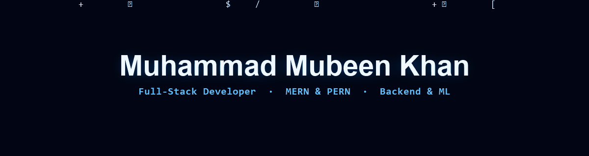

<!-- ============ HEADER ============ -->

  
  

 

## About

I'm a **Computer Science student** at COMSATS University Islamabad (CUI '28) and a **Full-Stack developer** working across the **MERN and PERN** stacks to build secure, scalable web applications.

My work centers on backend architecture, REST API design, and real-time WebSocket systems — with clean authentication lifecycles built on JWT and role-based access control.

- 🔭 Building full-stack apps with Node.js, React, MongoDB, PostgreSQL & Socket.IO
- 🛡️ Backend & security focused — JWT · RBAC · REST APIs · Docker
- 🤖 Exploring Machine Learning (classification models with scikit-learn)

 

## Tech Stack

  

 

## GitHub Stats

  

 

## Education

**BS Computer Science** — COMSATS University Islamabad · *Sep 2024 – Present · GPA 3.84 / 4.00*

 

<i>"Talk is cheap. Show me the code." — Linus Torvalds</i>

