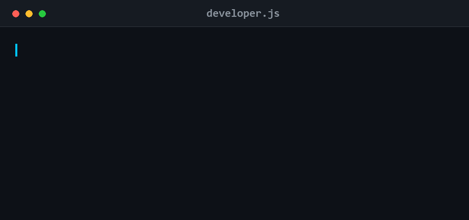

  
  
  

 

## About

I build **AI-powered web applications** end to end — from the React interface down to the agent orchestration layer and the vector store behind it.

My foundation is full-stack engineering on the **MERN** stack: REST API design, real-time WebSocket systems, and authentication built on JWT with role-based access control. I've since moved that work toward AI — **LangChain** for agent orchestration, RAG pipelines, conversational memory, and transformer models served through **FastAPI**.

- 🤖 LLM applications — RAG · multi-agent systems · vector search
- 🧠 Deep learning in Python — PyTorch, transformers, CNNs, RNNs, scikit-learn
- ⚙️ Backend architecture — Node.js · FastAPI · microservices · Docker
- 🎓 CS student at COMSATS University Islamabad (CUI '28)

 

## Featured Work

**🧩 Multi-Agent AI Chat Platform** — `MERN · LangChain · Docker · AWS`
Microservices architecture on the MERN stack, using LangChain to orchestrate specialized agents with shared conversational memory, retrieval over user documents, and live web search.

**📝 T5 Text Summarizer** — `Python · FastAPI · React`
Abstractive summarization on a T5 transformer, served through a FastAPI inference API with a React frontend.

**📚 Deep Learning Projects** — `PyTorch · scikit-learn`
CNN and RNN implementations alongside classical regression and classification models.

 

## Tech Stack

**AI & Machine Learning**

  

**Web & Infrastructure**

  

 

## GitHub Stats

  
  

 

## Education

**BS Computer Science** — COMSATS University Islamabad · *Sep 2024 – Present · GPA 3.84 / 4.00*

 

<i>"Talk is cheap. Show me the code." — Linus Torvalds</i>

